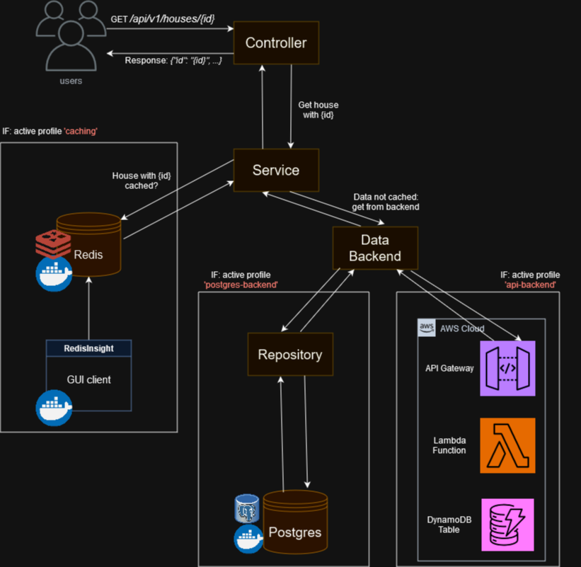

# Spring caching with Redis proof of concept

Demo application that uses Spring Data Redis and Spring Caching together.

- See [RedisConfig](src/main/java/org/caching/poc/config/RedisConfig.java) for the redis connection configuration.
- See [AppCachingConfig](src/main/java/org/caching/poc/config/AppCachingConfig.java) for the Redis caching configuration.
- See [HouseService](src/main/java/org/caching/poc/service/HouseService.java) for Spring Caching example usage.

High level diagram of the application:



If the `caching` profile is active, the app will use caching. If this profile is not active, 
the caching layer is disabled.

# Technologies used

- _Spring MVC_: for the REST API.
- _Spring Data_: JPA for the Postgres connection.
- _Spring Data Redis_: for the Redis connection.
- _Spring Cache_: abstracts away the caching logic.

# Run locally

Set up the required containers:

```
docker compose -f docker-compose.yaml up -d
```

This will create Postgres, a Redis and a RedisInsight container. The RedisInsight is a GUI client
available on http://localhost:8001, with the following credentials:

- Username: default
- Password: redispassword

Create a run configuration that launches `org.caching.poc.CachingApplication` Add all variables in `.env` to
the run configuration, or use an env file reader plugin in IntelliJ.

# Performance testing

For all details about performance testing, please see the [performance testing REDAME](performance_testing/README.md).

# Postman collection

A [postman collection](spring_caching_poc.postman_collection.json) is included that can be used to invoke the API.